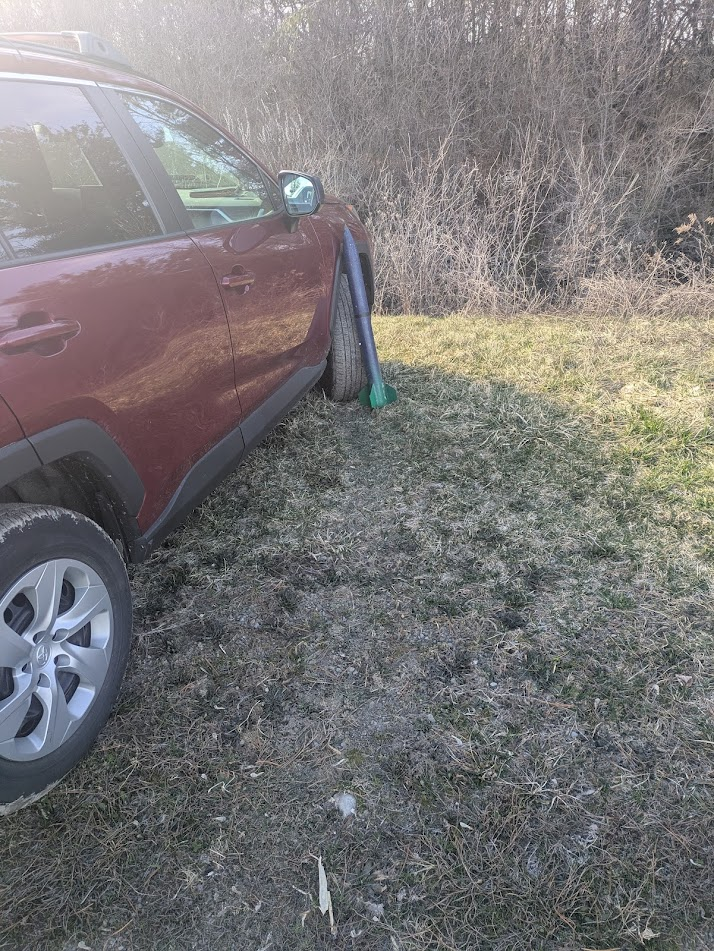

# Lyra

L1 Rocket

Equipped with a controls_module+babyplane for airbrakes sensor, kalman filter, and gyro integration testing and a featherweight for "ground truth" measurements. 

# Measurements 

| Section                    | Mass [g] |
| -------------------------- | -------- |
| Whole (w/ burnt motor)     | 758      |
| Whole (w/o burnt motor)    | 673      |
| Nosecone                   | 77       |
| Payload Bay                | 150      |
| Booster (w/ burnt motor)   | 512      |
| Booster (w/o burnt motor)  | 427      |
| Motor Retainer             | 13       |

# Data Products

## Controls Module Noise
Before flight took noise data with the featherweight turned on in a field rather than in the SHED or in an apartment. 
The noise is recorded like a flight so the code is doing the exact same thing, the rocket is just not moving. It can be loaded and parsed the same way as flight data

Noise data was recorded like so

## Control Module Flight

Stored under `flight/controls_module`. See `AirbrakeL1Tests/README.md` for information about the file formats.

## Featherweight

The saved data was downloaded from the featherweight and saved under `flight/featherweight`
