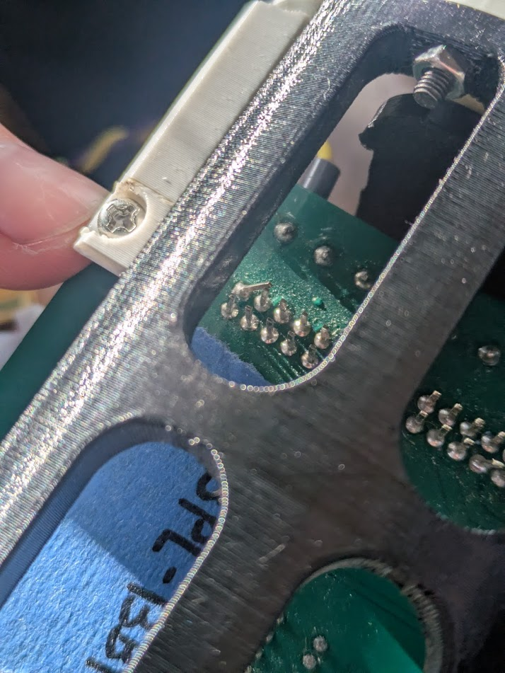
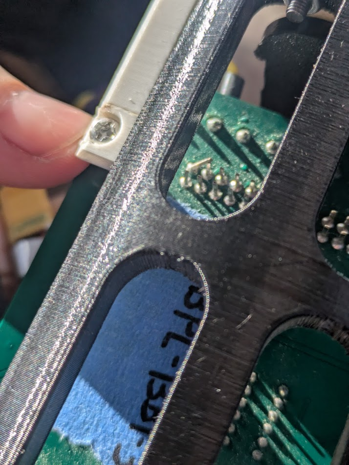
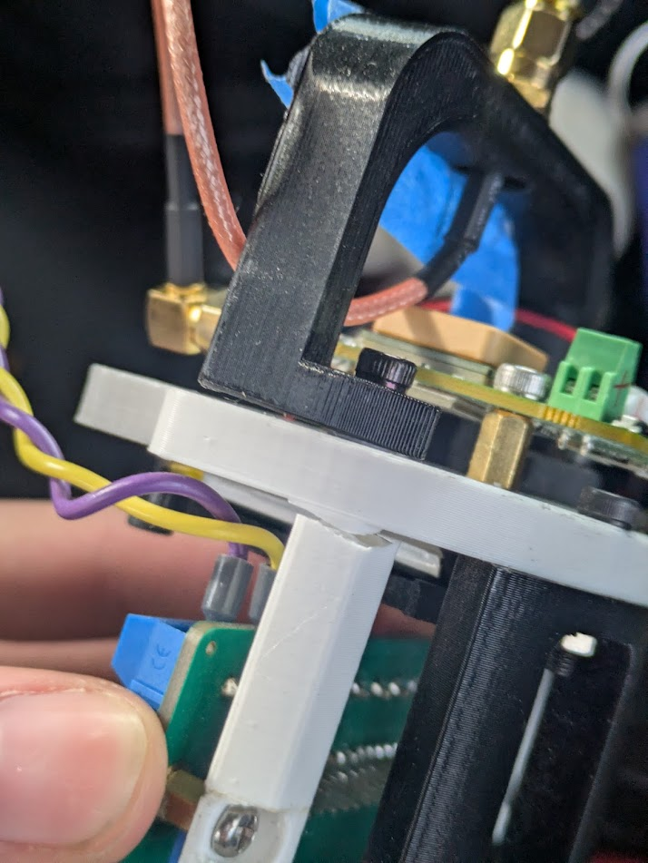
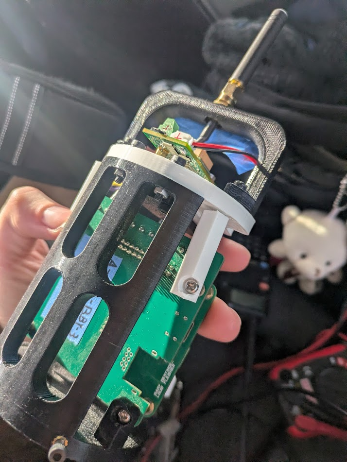
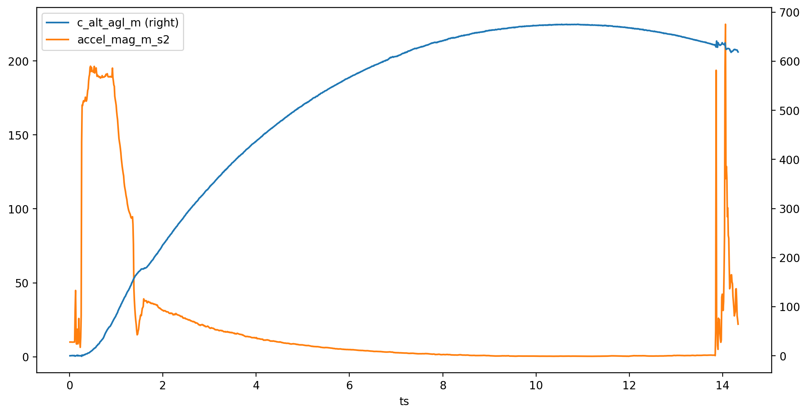

# Motown

L1 Rocket

Equipped with a controls_module+babyplane for airbrakes sensor, kalman filter, and gyro integration testing and a featherweight for "ground truth" measurements. 

# The Incident

## The beginning
1. Get rocket RSOed and integrate payload. Takes a bit of force to twist it to screw holes on this L1 
2. Set rocket up on the pad. 
3. See it launch last in the salvo
4. Goes quite high and looks to float far away but it wasn't so bad

## The Rumblings of Trouble

5. The buzzer beep that tries to get the attention of the RECO team and announce that boost was detected and the flight is over does not sound
6. Instructions given to maintain power and bring it back for diagnosis

## The Initial Diagnosis
Imagine a shorted battery in a car. And then stop imagining because we didn't realize it at the time. 

7. UART to USB converter connected but gives no signs of life
8. JLink with `--no-reset` attempts to connect but times out with suggestion "Please check power connection and settings"
9. Settings confirmed before, reseat SWD cable but still fails with same error
10. Measure voltage across VBAT to GND on Babyplane: 7.98 V
11. Measure 3.3V rail out of connector on controls_module: ~0.01 V
12. Observe the physical structure
    - note: Bent pin (VBAT towards GND) on 30 pin connector of baby plane

    - note: cracked support columns on left and right of board  
13. Ponder
    - VBAT pin could not be touching GND for very long or we would have a much bigger problem on our hands in the mad battery department. Initial assumption of them shorting and doing something bad discarded because it would take an insane amount of force to bend a pin that much. Still possibility that they were prebent at some point and briefly touched. 
    - Did have to apply a bit of force to the mount when going in. As of photos after Emma's flight but before Zoey's flight, mount is totally intact. Amount of force was not smashing but a firm twist to align screws
14. Unplug battery until later autopsy

## The Autopsy
15. Eat food so we have our wits about us
16. Bend babyplane VBAT pin away from ground
17. Attach 8V from power supply to VBAT on babyplane screw connector 
18. Enable power supply and controls_module+babyplane stack immedietly appear to be overcurrenting. Further tests show it consuming 0.54 A. Power supply was set for 8.00 V but shows 8.14 V
19. Remove flight controls_module from flight babyplane
20. Enable power to only babyplane and verify 3.3V regulator, 5V regulator, and VBAT are as expected with no module on
21. Attach known good controls_module to flight babyplane and verify normal behavior and current draw (0.041 A)
22. Attach known good babyplane to flight controls_module and verify large current draw
23. Switch back to testing flight controls_module on flight babyplane  
24. Enable power supply, measure VBAT to GND on screw connector at 5.7V, 3.3V rail on controls_module still at basically zero
25. 3.3V regulator on babyplane heats up PCB around it when running 
26. Only things on VBAT rail on controls_module are pyro channels and ematch. 
27. Remove 0 ohm resistor to pyro power to separate concerns. Nothing changes
28. Touch chips on the board and realize wiznet is hot. Subsequent touches show its only vaguely warm not hot.
29. With no way to turn on the board, no other ideas and a big red flag, we decide to remove the w5500 from the board.
30. DRD goes to town and removes chip, legs, and solder. Verified under microscope that probably no pads are touching
31. Reconnect flight babyplane and flight controls module to power supply
32. Shows <0.041 A current draw and exactly 8 V
33. Plug in USB to UART converter and board working as expected
34. Successfully dump data from serial. Verify parameters, preboost data, some flight data followed by large amount of erase value (0xff)
35. Plot data that is available. Signs point to event at snatch. By construction, after boost all data writing is done in a single loop so between the last value written and disaster is no more than 10ms

## Theories

- FOD
- Snatch caused giant acceleration which made pins touch which made regulator do something which kills the w5500 and only the w5500
- aliens?
- vindictive enemy IREC teams

# Data Products

## Control Module Flight

Stored under `flight/controls_module`. See `AirbrakeL1Tests/README.md` for information about the file formats.

## Featherweight

The saved data was downloaded from the featherweight and saved under `flight/featherweight`
